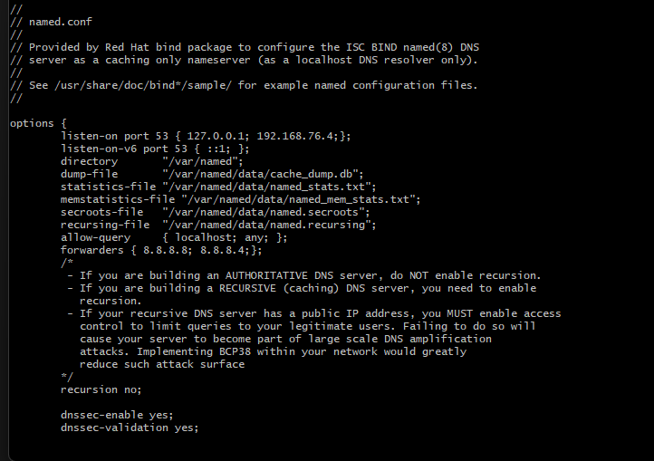
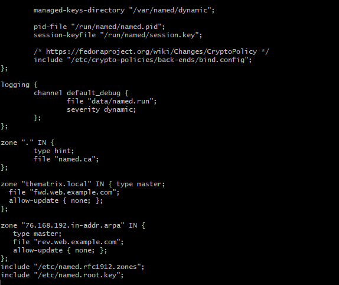
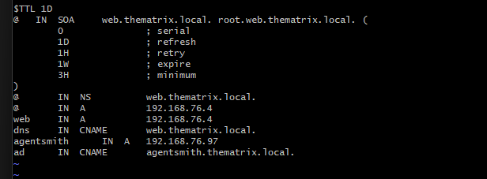
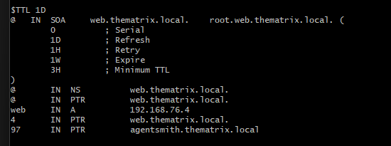
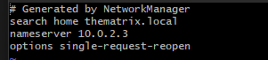

### Stap 1

Installeren bind : \*_sudo yum install bind_ -y\*

### Stap 2

Hostname aanpassen naar morpheus.thematrix.local : 
_hostnamectl set-hostname morpheus.thematrix.local_

### Stap 3

/etc/named.conf aanpassen

listen-on port 53 {127.0.0.1; Ip adres van DNS server;};  
allow-query {localhost; any; }; 
forwarders { 8.8.8.8; 8.8.8.4;}; 

2 zones toevoegen  
zone "thematrix.local" IN { 
type master; 
file "fwd.morpheus.thematrix.local"; 
allow-update { none; }; 
}; 

zone "76.168.192.in-addr.arpa" IN { 
type master; 
file "rev.morpheus.thematrix.local"; 
allow-update { none; }; 
}; 

## Stap 4

zone files aanmaken in /var/named  

- fwd.morpheus.thematrix.local

$TTL 1D 
@ IN SOA morpheus.thematrix.local. root.morpheus.thematrix.local.  ( 
0 ; serial 
1D ; refresh 
1H ; retry 
1W ; expire 
3H ; minimum 
) 
@ IN NS morpheus.thematrix.local. 
@ IN A ip adres DNS server 
morpheus IN A ip adres DNS server 
dns IN CNAME morpheus.thematrix.local. 
agentsmith IN A 192.168.76.97 
ad IN CNAME agentsmith.thematrix.local. 

- rev.morpheus.thematrix.local

$TTL 1D
@ IN SOA morpheus.thematrix.local. root.morpheus.thematrix.local. (
0 ; Serial
1D ; Refresh
1H ; Retry
1W ; Expire
3H ; Minimum TTL
)
@ IN NS morpheus.thematrix.local.
@ IN PTR morpheus.thematrix.local.
morpheus IN A IP ADRES DNS SERVER
4 IN PTR morpheus.thematrix.local.
97 IN PTR agentsmith.thematrix.local

## Stap 5

/etc/resolve.conf aanpassen 
 
Generated by NetworkManager 
search thematrix.local 
nameserver IP ADRES DNS SERVER 
options single-request-reopen 

# SCREENSHOTS

**named.conf**

 

**fwd.morpheus.thematrix.local (DIT IS EEN VOORBEELD!)**
 

**ZIE STAP 4 VOOR EFFECTIEVE LAY OUT**

**rev.morpheus.thematrix.local (DIT IS EEN VOORBEELD!)**
 

**ZIE STAP 4 VOOR EFFECTIEVE LAY OUT**

**Resolve.conf** 
 
