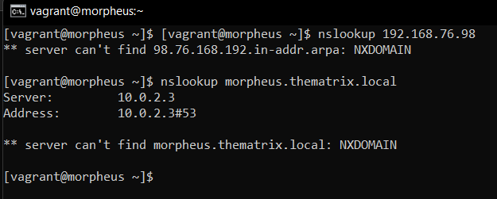
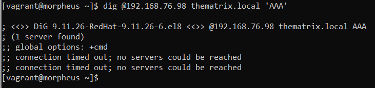

# Testrapport Opdracht 1: DNS Server

## Test 1.0: Hostname

Na het uitvoeren van het commando `hostnamectl` kwam het resultaat (ongeveer) overeen met wat we verwacht hadden. Het domein werd er aan toegevoegd, maar het resultaat is nog altijd correct.  


## Test 1.1: SSH-Keys inlogsysteem, hier is de bedoeling dat we kunnen inloggen aan de hand van SSH-keys zonder authenticatie van een wachtwoord.

Het inloggen via SSH lukt, maar er wordt hier helaas wel nog gevraagd om een wachtwoord in te geven...  


Ik heb mijn SSH public key toegevoegd aan het bestand authorized_keys. Deze werd gegeneerd via het commando `ssh-keygen`.

Inhoud Authorized_keys:

```
ssh-rsa AAAAB3NzaC1yc2EAAAADAQABAAABgQDYxq1SFcyFGfXLgdwCT6q5q5NcM1wOBBinkz6aqYL4BJJmjRBfshzZLlBBEl9v1PTu2/i6RnlJDrHM0zMsb7731+nTPeH4pjyTFltyUhKLcD6WSDzwrYlkicaboMMktiH/e0R7mK5O9w+p4BcB8hpU9gusrOVLuATnV1M5yLu0fP7LP3jdfr4lZ26j9og72rqb1GlAHM4iekSgaZjyA3tPIEsfAn+hi8F4RhXWoJMYOTUlabS9n7HvwCevROblCJt5lbnmaquXeaTj08YMK1Mr2H4OQ9+NjP2YvmwouWn9EIQlEtMzJhiZRb4+bDbFjw6kN5/UVPuwPiCXecPzcZHKLpS14Qja/hxuAixCjYee1HQQd1tSntWQRpicsi/6TuHV/YKqhZACsIj6CKSQC5n1McTg+oJ+FRvswJvl5wJ4mGZczeMoYQT8j/S2/+cFl32Nk7rwUzPz5WDyNpAYfHeXAVBQR4M6fG9oujL4X/ZtQpC5WN7OiGMaQgDdvYMWlvE= Sande@MSI
ssh-rsa AAAAB3NzaC1yc2EAAAADAQABAAABgQC3ni5VKpttXbhedVd5pAhWmrw8Kos41vZY/UijoDOKN+/MqU0ef/Ynv2o3Q+zEhe6deWh2MMCsCXKPZ/mhiYlsbbiebXOYmyanZjI4HhB9J2wOdGq4VtSqhxIyeLozHqXzicxyhEwJJwc3ozoLfAIg4ZZKwC0eMIfMHrfCpK9iQiz9NIH0w3JRgvi4ZFmrc33uZ+QmZZZOwRuoiyjWEZivdBynVZt/kB/niIpdsjq4RgMMN5GJRVAkTj4+OiJJ0aL630sMLDPVTJR6+KjZkl6n9UdoDKejKlClfw+SNRQKem0yA/q+LYB0w/n//rKwZe/bIop+thOnkLiF7uwgAin8qtOdQGNcStDGqI+RwD3PaFKyDTyvFfrdH1Z3X2ysQBU81/ObJgxAVvHY5WbLx91ELKXkHgs9sY3CfpiEMymuKxns1MPaNePwIT/Y+YDNDzEwR3ID6oX1E6dQrFAxLLR2TnzkzxWVHkbVlDUMik/igDxn6VMbda+BotC3FQmKAn8= joche@LAPTOP-I489N0ID
ssh-rsa AAAAB3NzaC1yc2EAAAADAQABAAABgQDKuyNVuUT7ATtCMDktYlXTwazHOqnMXE28oAlo+lgMZJ+JekULIwhQ44V9J1J5fmoOy3GdzkIa/WWzcH9Fnx/zMOtCSUqcyIaTG7QSGZFZLdLsrN4virk4J0U5pYzaWDti7C3RraBU2cEjZUaI9r5ddIeGheIsaFx8Af4l/3R4SSa+5Pm42QckLkROjcu4BkFUSID7IuGXljArmGkvQadZV5bmL1KFKgGH4xDKibu8ec9hCAQXhcQZ0Zi+ZvSrurvHlzTG6vN+zsP68oMK2UEqBQQoO+68Tx4Vq1k9F7G/hSFjJjhny3VtyPrnEk/4LMoGYrGxjlEGYW6qYcrbSPihCq4PJ1XgDasTMxZfSSF+5v1yE1BJsKD/yhLmxok2ngT7EtAnX2kDqqTA5WIlq+tfShGRnxeQPafpNX9WmNcR6MUJjh1d1mF397VEAOuugA+0TItdMUGppd42kmhln0EjBOy5I+3neL/VLelFSSP6RSr4vnv3BSXH+S5g3S5v6F8= jornd@LAPTOP-JH4V7PV7
```

Ook heb ik port forwarding correct ingesteld via de instellingen van Virtual Box:  


## 1.2 DNS de authorised server van thematrix.local

Na het uitvoeren van `nslookup morpheus.thematrix.local` (GELUKT):  


Na het uitvoeren van `nslookup www.hogent.be` (GELUKT):  


Er zal een ticket voor de eerste worden gemaakt.

## 1.3 Queries voor andere domein geforward naar gepaste externe DNS-server?

Na het uitvoeren van het commando `nslookup www.google.com` kreeg ik de verwachte output. Deze test is dus GELUKT:  


## 1.4 A, AAA en PTR records in de gepaste zonebestanden?

Na het uitvoeren van `Dig @192.168.76.98 thematrix.local` (NIET GELUKT):  


Na het uitvoeren van `Dig @192.168.76.98 thematrix.local ‘AAA’` (NIET GELUKT):  


Na het uitvoeren van `Dig @192.168.76.98 thematrix.local ‘PTR’` (GELUKT):  


Helaas zijn er maar 2 van de 3 digs getest. Hiervoor zal er een ticket op trello worden gemaakt.

## 1.5 Geschikte CNAME en overige records?

Het commando `nslookup dns` gaf geen goed resultaat (NIET GELUKT):  


Ook het commando `nslookup ad` was niet wat we verwacht hadden (NIET GELUKT):  


Hiervoor zal er een ticket op trello voor worden gemaakt.

Uitvoerder(s) test: Jorn De Meyer  
Uitgevoerd op: 15/03/2022  
Github commit: a65039060ac255cb3f8554ab54b48bbe54fa2f83
