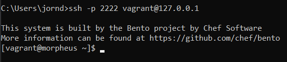
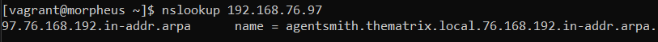
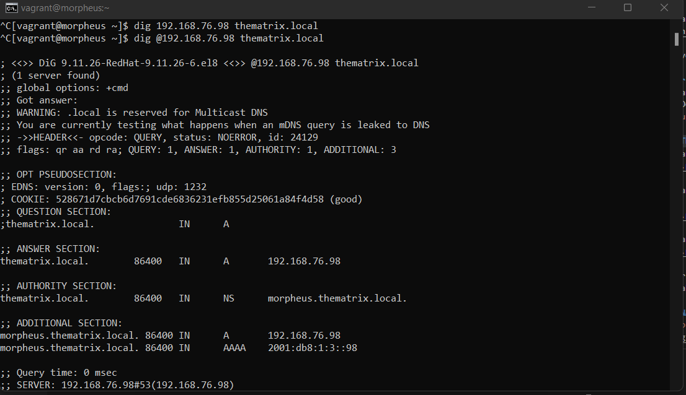
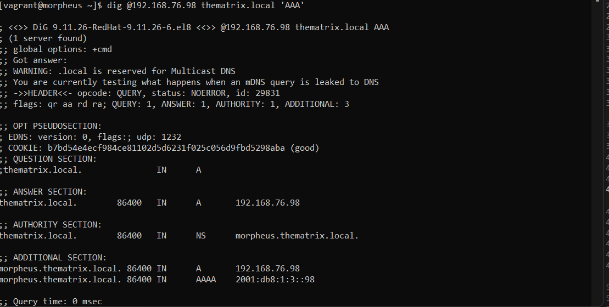
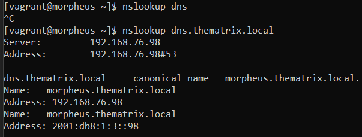
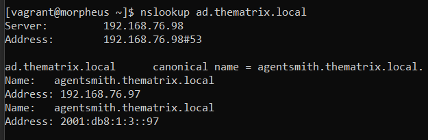

# Testrapport Opdracht x: (titel)

## Test 1: SSH test
Na enkele wijzigingen en fixes aan het script lukte het dit keer wel om via SSH in te loggen op de DNS server via CMD.  

Uitvoerder(s) test: Jorn De Meyer
Uitgevoerd op: 16/03/2022
Github commit:  COMMIT HASH

## Test 2: DNS de authorised server van thematrix.local
Bij de vorige test probeerden we te nslookupen naar 192.168.76.98.  
We wijzigen dit naar het adres 192.168.76.97. Dit is het adres van de AD-Server.  

## Test 3: A, AAA en PTR records in de gepaste zonebestanden?

Hierbij slaagden de eerste en tweede test niet. Laten we deze hernemen:  
* `dig @192.168.76.98 thematrix.local`  
  

* `Dig @192.168.76.98 thematrix.local ‘AAA’`  

## Test 4: Geschikte CNAME en overige records?
De laatste tests worden nu opnieuw herbekeken.
* `nslookup dns.thematrix.local`  
  

* `nslookup dns.thematrix.local`

## Besluit
Alle problemen werden goed opgelost. Goed gedaan, team-DNS! 

Uitvoerder(s) test: Jorn De Meyer  
Uitgevoerd op: 15/03/2022  
Github commit:  518a4c2f2fbc478268adb0cc322f589eaecab247
