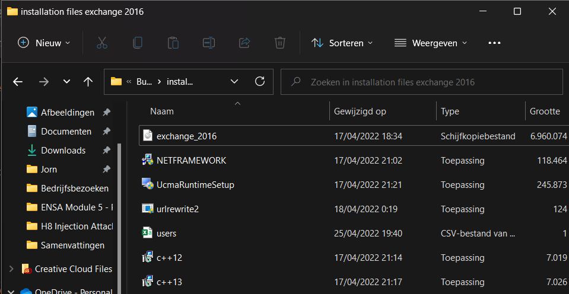
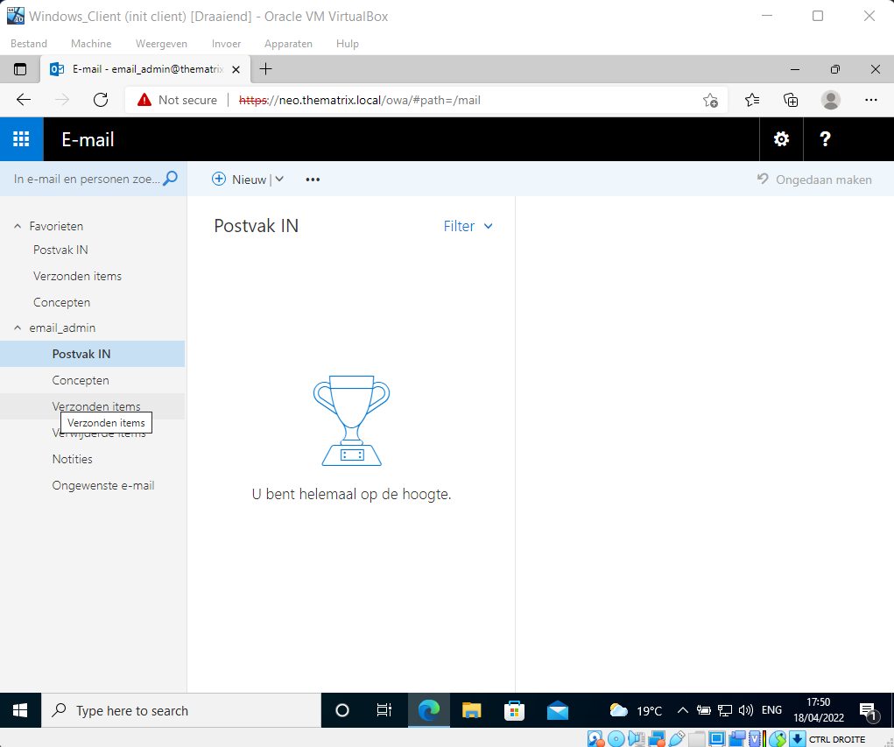

# Testplan Opdracht 1: Email-Server

Auteur(s) testplan: Kevin Benoit, Jorn De Meyer

# Email-Server

## Benodigdheden

- Windows Server 2019. Dit is de active directory die werd uitgewerkt in de vorige opdracht.
- Windows Client (versie Windows 10). Deze werd ook aangemaakt bij het testen van de AD-server.
- Windows Server 2016. Deze server zal fungeren als de e-mail server.
  - Geef deze server minstens 8GB RAM en 100GB hdd.
- DNS server. Deze werd reeds gemaakt. Creeër deze d.m.v. Vagrant

- Een map op je host systeem. Noem deze map "installation_files_exchange_2016". Deze map bevat de volgende bestanden:

  - .NET framework 4.8 (geef deze de naam: NETFRAMEWORK)
    - Deze kan je ophalen via: [link1](https://dotnet.microsoft.com/en-us/download/dotnet-framework/thank-you/net48-web-installer)
  - UCMARuntimeSetup (geef deze de naam: UcmaRuntimeSetup)
    - Deze kan je ophalen via: [link2](https://download.microsoft.com/download/2/C/4/2C47A5C1-A1F3-4843-B9FE-84C0032C61EC/UcmaRuntimeSetup.exe)
  - urlrewrite2 (geef deze de naam: urlrewrite2)
    - Deze kan je ophalen via: [link3](https://www.iis.net/downloads/microsoft/url-rewrite)
  - Het users.csv bestand. Dit bestand kan je copy-pasten van de map voor de AD-server
  - c++ 2012 installer (geef deze de naam: c++12). Deze kan je ophalen via: [link4](https://download.microsoft.com/download/1/6/B/16B06F60-3B20-4FF2-B699-5E9B7962F9AE/VSU_4/vcredist_x64.exe)
  - c++ 2013 installer (geef deze de naam: c++13). Deze kan je ophalen via: [link5](https://download.microsoft.com/download/2/E/6/2E61CFA4-993B-4DD4-91DA-3737CD5CD6E3/vcredist_x64.exe)
  - Exchange 2016 ISO (geef deze de naam: exchange_2016). Deze kan je ophalen via: [link6](https://download.microsoft.com/download/f/0/e/f0e65686-3761-4c9d-b8b2-9fb71a207b8d/ExchangeServer2016-x64-CU22.ISO)

  Je zou nu dit overzicht moeten hebben:
  

### Te bekomen resultaten

- Hostname is 'neo'
- Exchange Server 2016 is geïnstalleerd
- Accounts gesyncroniseerd met Active Directory
- Mail versturen van admin naar admin mogelijk.
- Mail versturen van admin naar user mogelijk.
- Genoeg beveiliging (spam filter, virusscanner)

## 1. Correcte Hostname "Neo"

- Kijk dit na via `$env:COMPUTERNAME`

## 2. Exchange Server Installatie

- Gebruik het commando `Get-ExchangeServer` om na te gaan of Exchange correct werd geïnstalleerd.
- Surf naar: https://thematrix.local/ECP op de Exchange Server.
  - Log in met het account van de email_admin en kijk of je toegang hebt.

## 3. Accountsynchronisatie via AD-server

1. Surf via jouw client naar `https://neo.thematrix.local` met een webbrowser.
2. Probeer hier in te loggen met een gebruiker.
3. Eindresultaat = De gebruiker werd succesvol ingelogd.
   Voorbeeld:
   

# 4. Mail van admin naar admin

- Log in als admin zodat je zijn postvak te zien krijgt. Verstuur nu een e-mail naar de admin (jezelf dus).

# 5. Mail van admin naar user

- Probeer als admine een e-mail te versturen naar een andere user.
  - test ook of het omgekeerde mogelijk is (van user naar admin).

# 6. Security: Spam filter & virusscanner

Log in op jouw eigen e-mail adres (bv. van HOGENT).

- Verstuur een e-mail die je vond in de spam filter naar een account binnen het domein .
- Zoek online naar wat test malware (Goeie site hiervoor: (https://www.eicar.org/?page_id=3950)[https://www.eicar.org/?page_id=3950]). Download één van deze bestanden en probeer deze door te mailen naar een account. Kijk wat de reactie is van de mailbox.

Spam filter kan je niet echt testen, dus dit hoef je niet te doen. Kijk wel na of er een spamfilter werd geconfigureerd via het script!
