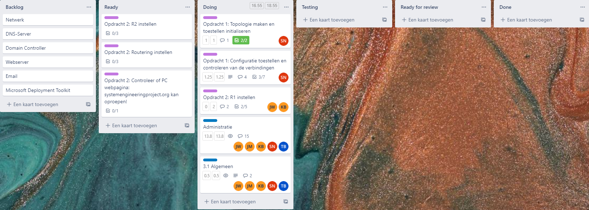
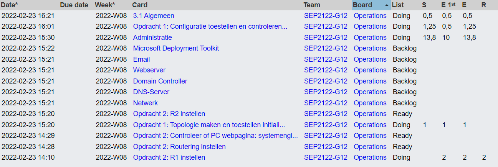

# Voortgangsrapport week 23/2 - 2/2 (W2)

- Groep: 12
- Datum voortgangsgesprek: 02/03/2022

| Student              | Aanw. | Opmerking |
| :------------------- | :---- | :-------- |
| Jorn De Meyer        |       |           |
| Jochen Wimme         |       |           |
| Kevin Benoit         |       |           |
| Sander Van Noten     |       |           |
| Tibbe Van Den Berghe |       |           |

## Wat heb je deze week gerealiseerd?

### Algemeen

Deze week hebben we ons vooral beziggehouden met de takenverdeling. Ook het opzetten van een handige en praktische werkomgeving (GitHub, communicatiekanaal, ...) was ook zeker één van de kerntaken waar we ons mee bezig hebben gehouden. Ten slotte werd er ook al wat gewerkt aan beide Cisco-Labo opdrachten.

- Topologie bekeken

### Jorn De Meyer

- Tijdens de eerste week van het project heb ik me beziggehouden met de eerste Cisco Labo-opdracht. Concreet voerde ik de volgende taken uit:
  - Lessen, studiewijzer en trello workshop doornomen.
  - Netwerk opstelling bouwen
  - Initialiseer/reload de routers
  - Configureren van de IPv6 adressen op de hosts
  - Helpen aan de opstelling

### Jochen Wimme

- De lessen gevolgd waaronder de inleiding, de studiewijzer, de werking van trello en de opdrachten doorgenomen.
- oprdacht 2 van de cisco opdrachten begonnen.
- Met trello leren werken.
- Samen gezeten om al eens een topologie voor het grote toekomstig netwerk.

### Kevin Benoit

- In de eerste week van dit project, heb ik de studiewijzer al is bekeken. Ook ben ik reeds begonnen aan Labo 2 van de packet tracer.
- Ook ben ik begonnen aan het opstellen van een topologie van alle servers en switches
- Werking van Trello bekeken

### Sander Van Noten

- Ik heb de studiewijzer grondig doorgenomen en de opdrachten begrepen.
- Verder gewerkt aan deel 1 van de cisco labo's waar Jorn geeindigd is. 
- de werking van trello nog is doorgenomen.
- De topologie van ons netwerk al eens gesimuleerd op packet tracer

### Tibbe Van den Berghe

- Ik heb de studiewijzer bekeken.
- Ik heb de voortgang van de cisco labo's bekeken die door mijn andere groepsleden reeds een deel zijn gemaakt.
- Trello op punt gezet en alle opdrachten toegevoegd.
- Nog verder bekeken hoe de topologie van het netwerk gaat functioneren.

## Wat plan je volgende week te doen?

### Algemeen
- Topologie bekijken
### Jorn De Meyer
- De opdracht rond DNS volledig afwerken zodat we deze kunnen tonen aan de begeleiders.  
- Als er tijd over is: verder werken aan Cisco Labo's & Subnetting
### Jochen Wimme
- Dns configureren en afwerken
- Indien mogelijk Cisco opdracht 2 afwerken
### Kevin Benoit

### Sander Van Noten
- Starten aan het eerste labo voor "DNS en AD"
- eventueel subnetting voor de gemaakte topologie
### Tibbe Van den Berghe
- DNS en AD bekijken en opzetten
- Kijken naar de subnetting van het netwerk
- Enkele connectiviteitstesten uitvoeren
## Waar hebben jullie nog problemen mee?

- ...
- ...

## Feedback technisch luik

### Algemeen

### Jorn De Meyer

### Jochen Wimme

### Kevin Benoit

### Sander Van Noten

### Tibbe Van den Berghe

## Feedback analyseluik

### Algemeen

### Jorn De Meyer

### Jochen Wimme

### Kevin Benoit

### Sander Van Noten

### Tibbe Van den Berghe
