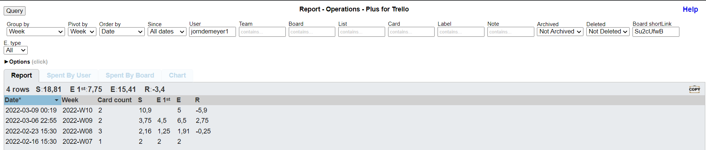
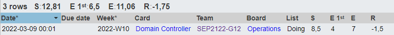

# Voortgangsrapport week 3

- Groep: 12
- Datum voortgangsgesprek: 9/03/2022

| Student  | Aanw. | Opmerking |
| :------- | :---- | :-------- |
| Jorn De Meyer |       |           |
| student2 |       |           |
| student3 |       |           |
| student4 |       |           |
| student5 |       |           |

## Wat heb je deze week gerealiseerd?

### Deze week hebben we ons voornamelijk beziggehouden met het uitwerken van de eerste 2 opdrachten. Sander, Jochen en Kevin hadden het druk met het opzetten van een DNS server in een Linux-omgeving.

### Tibbe en Jorn hebben vooral gewerkt binnenin een Windows-Server VM om een AD-structuur aan te maken.

### Jorn De Meyer

- Deze week was ik heel druk bezig met het uitwerken van het AD script. Ik ondervond een grote moeilijkheid bij het aanmaken en instellen van de verschillende GPO's. De rest van de opdracht verliep vrij soepel.

### Jochen Wimme

- Ik was samen met Sander voor het afwerken van de DNS server, ikzelf werd daarna ook aangesteld om de scripting voor deze server in orde te maken aangezien ik hier genoeg kennis over heb.

### Kevin Benoit

- Ik ben samen met Jochen en Sander begonnen aan de DNS-server, ik heb dan ook de testplan opgesteld voor de DNS server. Dan heb ik ook
  samen met Jorn verdergezocht voor de laatste puntjes van de AD (Game link menu, properties, ...)

### Sander Van Noten

- Deze week al mijn tijd gestoken het opzetten van een DNS BIND linux server en het schrijven van een stappenplan zodat Jochen gemakkelijk aan het script kon beginnen. Deze opdracht verliep moeizamer dan verwacht en heeft ons wat meer tijd gekost dan ingeschat. Dit voornamelijk door een syntaxfout.

### Tibbe Van Den Berghe

- Uitzoeken hoe een PS script nog na het booten verder uitgevoerd kan worden. Kan A.D.H.V. workflows maar heb dit niet werkend gekregen
- Subnetten bekeken
- Geholpen aan het PS script voor AD/domeincontroller
- Ik was tegen het einde van de week ziek dus heb het contactmoment niet kunnen meedoen

## Wat plan je volgende week te doen?

### Algemeen

Algemeen plannen we om de laatste problemen rond de eerste opdracht op te lossen en al een deeltje van de 2de opdracht uit te werken.

### Jorn De Meyer

Ik ga proberen om de laatste problemen uit het AD-script te filteren en deze op te lossen. Daarna ga ik me bezighouden met de taak die ik krijg voor de volgende opdracht.

### Jochen Wimme

We hebben nog 1 ssh probleemje bij de dns server, en moeten enkel nog ipv6 addressen hebben voor AAAA records te maken

### Kevin Benoit

### Sander Van Noten

De planning voor volgende week zal bestaan uit het verbeteren van het script en eventuele ontbrekende zaken aanvullen en alles grondig testen. Ook wil ik graag starten aan de volgende opdracht.

### Tibbe Van Den Berghe

Jorn helpen met het AD script, workflows verder uitzoeken.

## Waar hebben jullie nog problemen mee?

- Met de opdracht van Active Directory -> instellen GPO's en configuratie DFS-systeem.
- Met de opdracht rond DNS-server -> het scripten van een paswoord loze ssh verbinding

## Feedback technisch luik

### Algemeen

### Algemeen

### Jorn De Meyer

### Jochen Wimme

### Kevin Benoit

### Sander Van Noten

### Tibbe Van Den Berghe

## Feedback analyseluik

### Algemeen

### Algemeen

### Jorn De Meyer

### Jochen Wimme

### Kevin Benoit

### Sander Van Noten

### Tibbe Van Den Berghe
