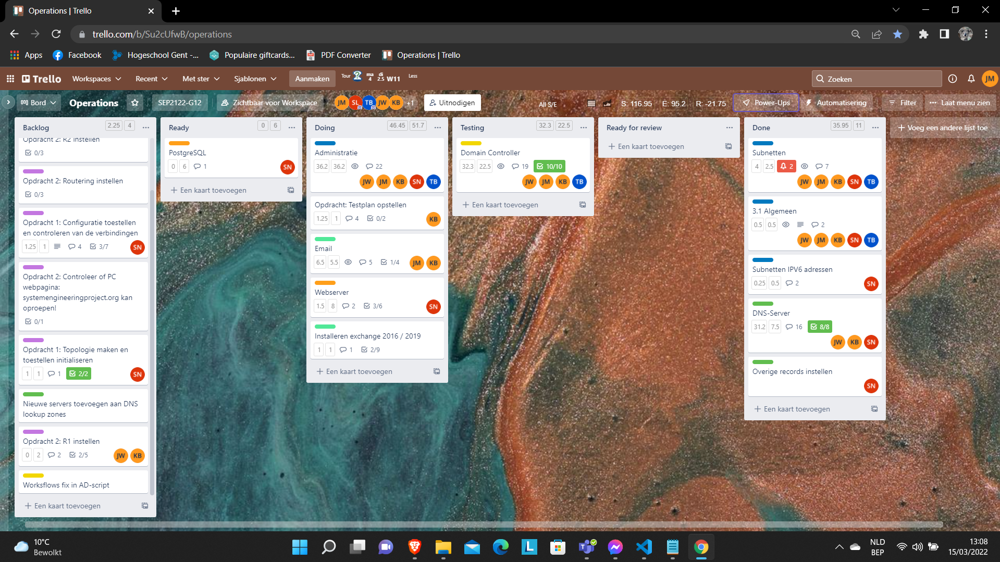
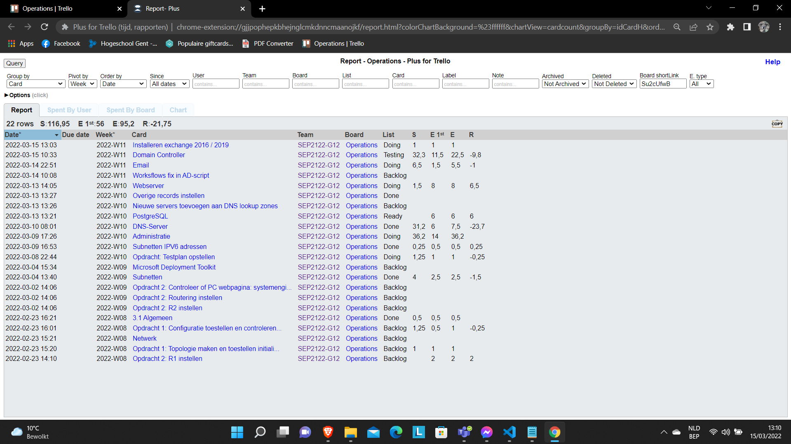
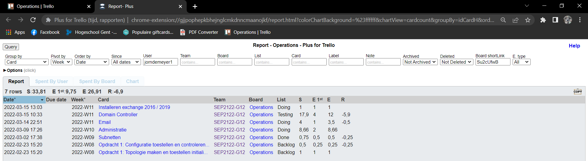
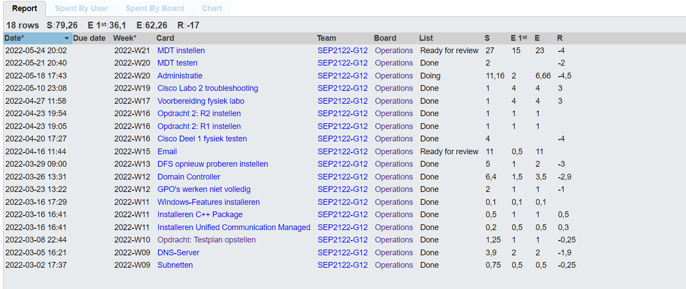
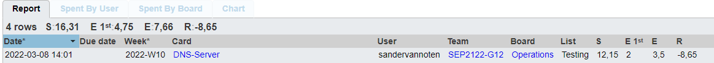

# Voortgangsrapport week 4

- Groep: 12
- Datum voortgangsgesprek: 16/03/2022

| Student  | Aanw. | Opmerking |
| :------- | :---- | :-------- |
| Jorn De Meyer |       |           |
| student2 |       |           |
| student3 |       |           |
| student4 |       |           |
| student5 |       |           |

## Wat heb je deze week gerealiseerd?

### In week 4 waren we vooral bezig met de laatste wijzigingen aan te brengen aan het AD-script en het DNS-script.  
### Daarnaast werd er ook al hard gewerkt aan het script voor de webserver en voor de e-mailserver. 
### Ten slotte werd alles ook goed getest en werden er testrapporten en testplannen opgesteld.

### Jorn De Meyer

- Afgelopen week deed ik de laatste aanpassingen aan het AD-script en heb ik dit ook grondig getest op fouten/problemen. Ik heb daarnaast me ook druk beziggehouden met opzoekingswerk over de werking en installatie van een Exchange 2019 server.

### Jochen Wimme

- Ik was samen met Sander voor het afwerken van de DNS server, ikzelf werd daarna ook aangesteld om de scripting voor deze server in orde te maken aangezien ik hier genoeg kennis over heb.

### Kevin Benoit

- Ik ben samen met Jochen en Sander begonnen aan de DNS-server, ik heb dan ook de testplan opgesteld voor de DNS server. Dan heb ik ook
  samen met Jorn verdergezocht voor de laatste puntjes van de AD (Game link menu, properties, ...)

### Sander Van Noten

- Deze week al mijn tijd gestoken het opzetten van een DNS BIND linux server en het schrijven van een stappenplan zodat Jochen gemakkelijk aan het script kon beginnen. Deze opdracht verliep moeizamer dan verwacht en heeft ons wat meer tijd gekost dan ingeschat. Dit voornamelijk door een syntaxfout.

### Tibbe Van Den Berghe

- Uitzoeken hoe een PS script nog na het booten verder uitgevoerd kan worden. Kan A.D.H.V. workflows maar heb dit niet werkend gekregen
- Subnetten bekeken
- Geholpen aan het PS script voor AD/domeincontroller
- Ik was tegen het einde van de week ziek dus heb het contactmoment niet kunnen meedoen

## Wat plan je volgende week te doen?

### Algemeen

Algemeen plannen we om de laatste problemen rond de eerste opdracht op te lossen en al een deeltje van de 2de opdracht uit te werken.

### Jorn De Meyer

Volgende week wil ik dat de Exchange 2019 server volledig is afgewerkt en ook grondig werd getest. Hierbij wil ik dat het script perfect werd en er een duidelijk testplan en rapport werd opgesteld.

### Jochen Wimme

We hebben nog 1 ssh probleemje bij de dns server, en moeten enkel nog ipv6 addressen hebben voor AAAA records te maken

### Kevin Benoit

### Sander Van Noten

De planning voor volgende week zal bestaan uit het verbeteren van het script en eventuele ontbrekende zaken aanvullen en alles grondig testen. Ook wil ik graag starten aan de volgende opdracht.

### Tibbe Van Den Berghe

Jorn helpen met het AD script, workflows verder uitzoeken.

## Waar hebben jullie nog problemen mee?

- Opdracht rond Email-server: Niet meteen, is gewoon wat zoeken hoe alles met elkaar samenwerkt en wat je zoal nodig hebt om deze omgeving op te zetten.

- Opdracht rond Web-server

## Feedback technisch luik

### Algemeen

### Algemeen

### Jorn De Meyer

### Jochen Wimme

### Kevin Benoit

### Sander Van Noten

### Tibbe Van Den Berghe

## Feedback analyseluik

### Algemeen

### Algemeen

### Jorn De Meyer

### Jochen Wimme

### Kevin Benoit

### Sander Van Noten

### Tibbe Van Den Berghe
