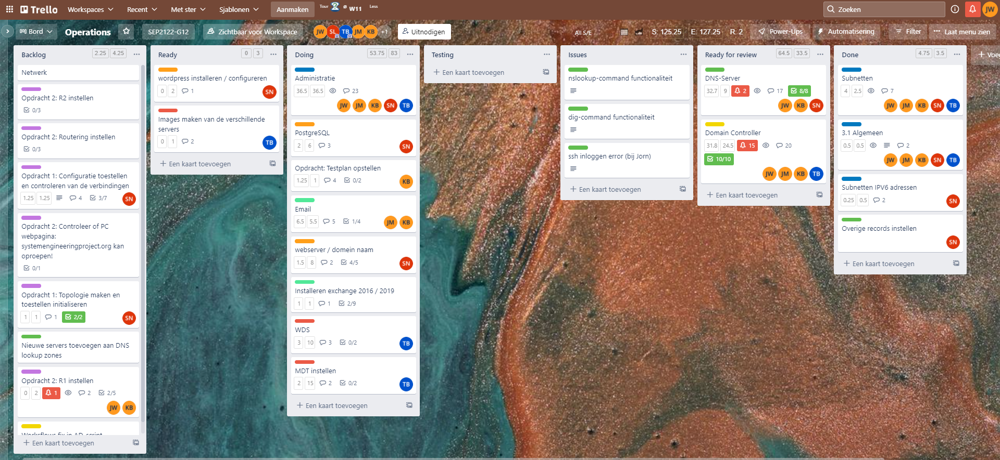
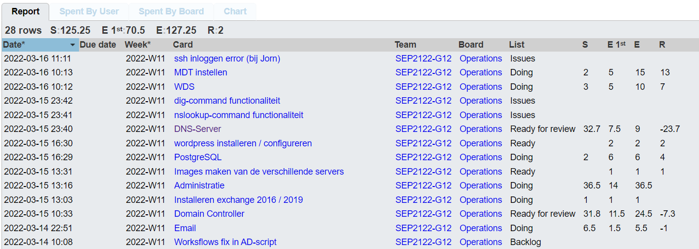
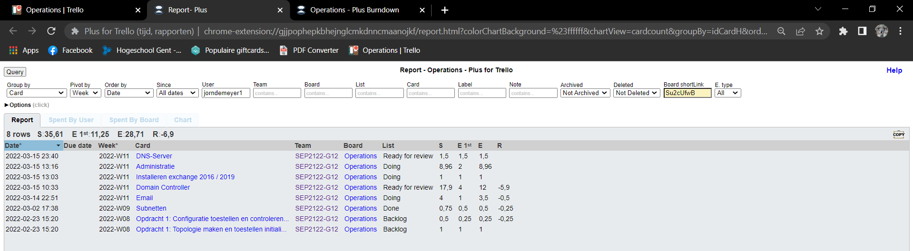
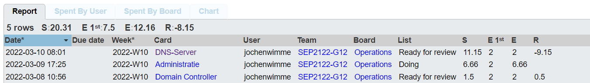
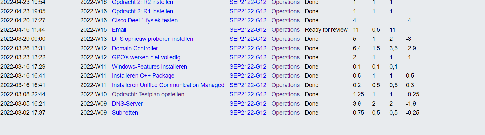
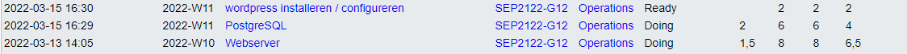
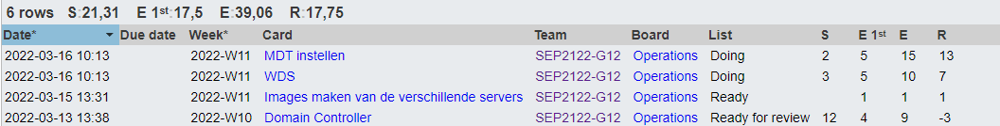

# Voortgangsrapport week 5

- Groep: G12
- Datum voortgangsgesprek: 16-3-2022

| Student  | Aanw. | Opmerking |
| :------- | :---- | :-------- |
| Jorn De Meyer |       |           |
| student2 |       |           |
| student3 |       |           |
| student4 |       |           |
| student5 |       |           |

## Wat heb je deze week gerealiseerd?

### Algemeen

### Jorn De Meyer

- Deze week heb ik vooral gewerkt aan de Exchange server en nog wat extra testen gedaan op de DC-VM met Kevin.

### Jochen Wimme

- Deze week ben ik afwezig geweest, heb dus niet veel kunnen verzetten van de opdrachten. Dit haal ik absoluut in in de komende weken.

### Kevin Benoit

- Ik heb deze week het testplan afgewerkt
- Ook heb ik samen met Jorn de AD afgewerkt zodat alles daarin inorde was
- Dan ben ik beginnen kijken naar de mailserver

### Sander Van Noten

- Deze week heb ik mij vooral beziggehouden met de opstart van de webserver en het bijhorende script. Ik heb nginx en postgresql successvol geconfigureerd en geinstalleerd. De volgende stap is het installeren en configureren van wordpress en dit integeren met de databank. Ik heb ook nog de laatste aanpassingen gemaakt aan het script voor de DNS server en het testplan.

### Tibbe Van Den Berghe

- Ik was ziek vorige week dus heb niet al te veel kunnen doen.
- Ik heb nog verder gezocht achter de workflows. Zonder succes.
- Ik heb mijn eigen wat kennis opgedaan over MDT en heb opgemerkt dat we ook WDS nodig hebben

## Wat plan je volgende week te doen?

### Algemeen

### Jorn De Meyer

- Volgende week ga ik me voornamelijk bezighouden met het afwerken van de Exchange Server 2019 en de bijbehorende documenten zoals testplan en administratie.

### Jochen Wimme

- Volgende week zou ik de cisco opdracht 1 willen afwerken.

### Kevin Benoit

### Sander Van Noten

- Volgende week zou ik graag de webserver af en werkende willen hebben en eventueel bijspringen waar nodig bij het maken van de mail server. Ik ga ook het testplan overlopen van de AD server en hierover het testrapport opmaken.

### Tibbe Van Den Berghe

- In week 6 gaat mijn focus liggen op het ondersteunen van de groepsleden waar nodig. Ik heb gemerkt dat MDT nu al uitrollen iets te vroeg is.

## Waar hebben jullie nog problemen mee?

- Het samenwerken van postgresql en wordpress
- ...

## Feedback technisch luik

### Algemeen

### Jorn De Meyer

### Jochen Wimme

### Kevin Benoit

### Sander Van Noten

### Tibbe Van Den Berghe

## Feedback analyseluik

### Algemeen

### Jorn De Meyer

### Jochen Wimme

### Kevin Benoit

### Sander Van Noten

### Tibbe Van Den Berghe
