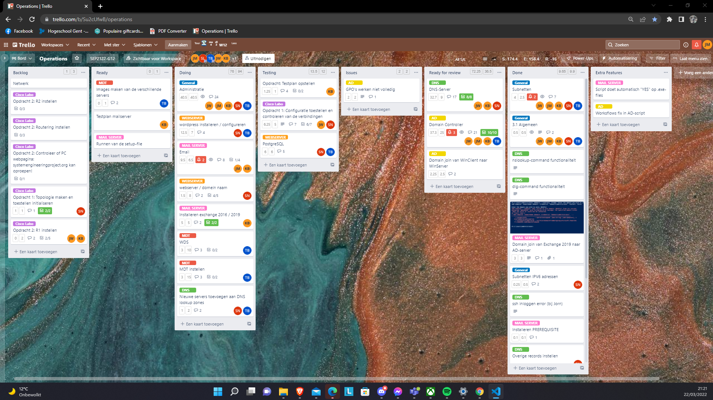
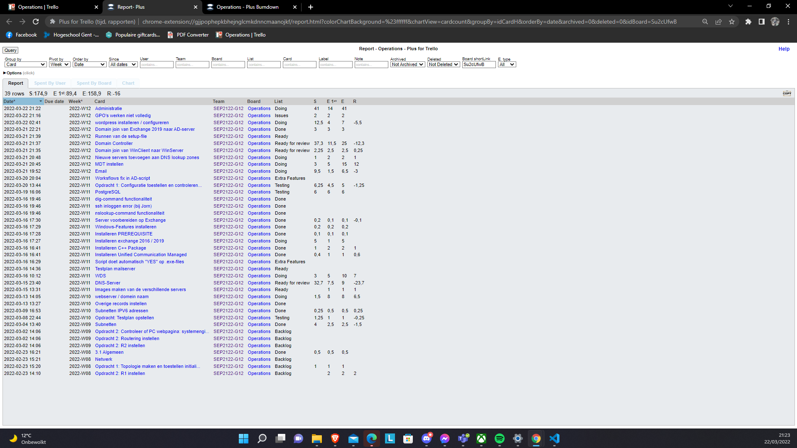
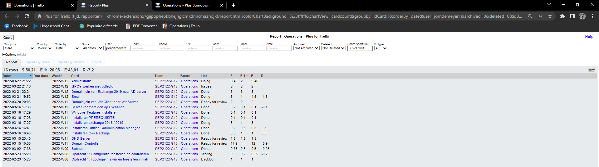
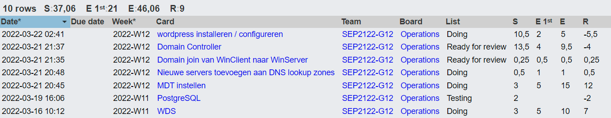

# Voortgangsrapport week 6

- Groep: 12
- Datum voortgangsgesprek: 23/03/2022

| Student       | Aanw. | Opmerking |
| :------------ | :---- | :-------- |
| Jorn De Meyer |       |           |
| Jochen Wimme  |       |           |
| student3      |       |           |
| student4      |       |           |
| student5      |       |           |

## Wat heb je deze week gerealiseerd?

### Algemeen

Deze week hebben we ons op verschillende taken gefocust. Er was een goede verdeling binnen de groep:

- Sander werkte aan het opzetten en configureren van de webserver. Ook tweakde hij de DNS-server een beetje.
- Kevin & Jorn werkten aan het opzetten van de Exchange 2019 server & configuratie. Ook werd er hierbij gewerkt aan nog enkele bugfixes van de AD-server.
- Jochen hield zich voornamelijk bezig met het uitwerken van de Cisco Packet Tracer opdrachten.
- Ten slotte was Tibbe druk bezig met het begrijpen en opzetten van de Microsoft Deployment Kit.

### Jorn De Meyer

- Deze week heb ik me voornamelijk beziggehouden met het begrijpen en opzetten van een Exchange 2019 server. Komende week ga ik mijn best doen om die tegen volgende week af te werken. Ook hield ik me bezig met nog enkele bugfixes in het AD-script.

### Jochen Wimme

- Deze week heb ik nog wat zitten troubleshooten om het cisco labo deel 1 in orde te krijgen. dit heb ik naderhand nog altijd niet kunnen oplossen

[Afbeelding individueel rapport tijdregistratie]

### Kevin Benoit

- Ik heb opzoekwerk gedaan over de Exchange Server, en hoe we dit volledig kunnen automatiseren
- Ik heb onze DFS proberen optimaliseren en werkende te krijgen

[Afbeelding individueel rapport tijdregistratie]

### Tibbe Van den Berghe

- MDT Uitgezocht. Ik heb al veel geleerd over MDT en WDS maar er is werk aan de winkel
- Ik heb ook wordpress werkende gekregen op de web server.

## Wat plan je volgende week te doen?

### Algemeen

Graag wensen we volgende week het grootste deel van de opdrachten waar we nu aan bezig zijn af te hebben, dit omvat:

- Webserver
- Exchange 2019
- Microsoft Deployment Kit
- Cisco Labo 01

### Jorn De Meyer

Komende week ga ik me voornamelijk bezighouden met het afwerken van de E-mailserver samen met Kevin.

### Jochen Wimme

Komende week wil ik mij vooral bezighouden met cisco labo 2

### Kevin Benoit
Komende week wil ik mij bezighouden met het afwerken van de DFS en E-mailserver samen met Jorn

### Tibbe Van den Berghe

Komende week ga ik de web server afwerken en er een testplan voor schrijven.

### Student 5

## Waar hebben jullie nog problemen mee?

- Active Directory -> GPO's.
- ...

## Feedback technisch luik

### DNS
* Documentatie
	* [ ] Lastenboek
	* [x] Testplan
	* [x] Testrapport
* Technische uitwerking
	* [x] Zonefile met records (SOA, NS, ...) aanwezig (Noot: geen reverse DNS voor ipv6)
	* [x] SSH met gebruiker root faalt (Noot: aangepast in week 7)
	* [x] SSH met public key + ip a
	* [x] Nslookup agentsmith.thematrix.local
	* [x] Nslookup google.be (Noot: aangepast in week 7)

### AD
* Documentatie
	* [x] Lastenboek
	* [x] Testplan
	* [x] Testrapport
* Technische uitwerking
	* [x] Domein "thematrix.local"
	* [x] OUs, gebruikers en computers gedefinieerd
	* Bewijs van policies:
		* [x] enkel IT Administratie kan control panel openen
		* [x] games link menu niet beschikbaar
		* [x] Administratie en Verkoop geen toegang netwerkadapters
	* [x] Gebruikersmappen aanwezig (Noot: aangepast in week 7)
