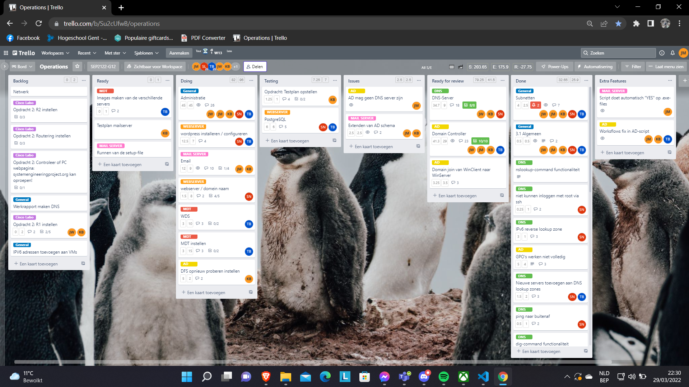
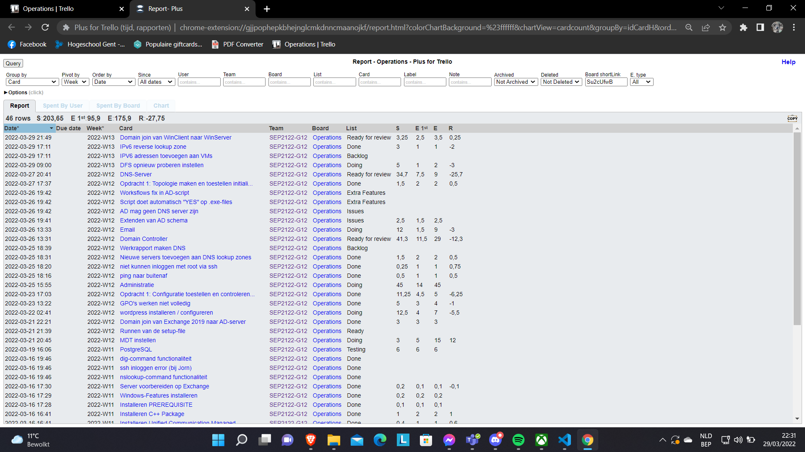
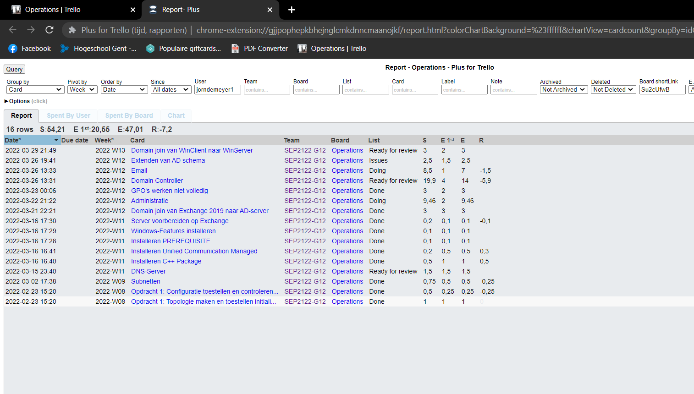
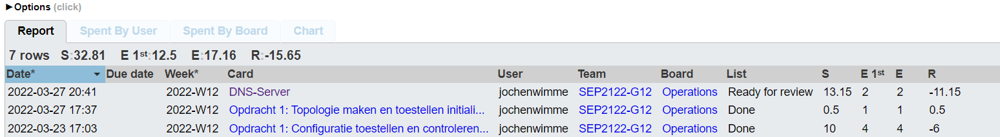
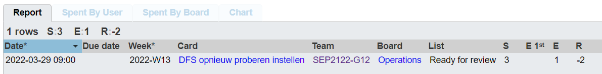
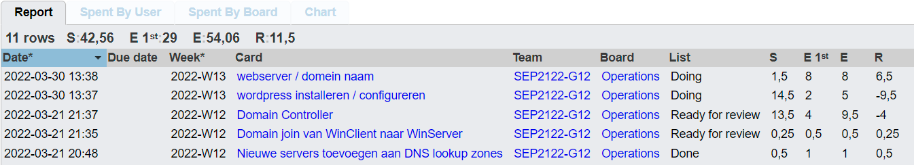
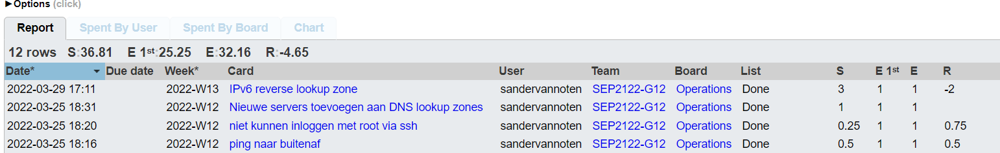

# Voortgangsrapport week 7

- Groep:
- Datum voortgangsgesprek:

| Student              | Aanw. | Opmerking |
| :------------------- | :---- | :-------- | --- |
| Jorn De Meyer        |       |           |
| Jochen Wimme         |       |           |
| Kevin Benoit         |       |           |
| Sander Van Noten     |       |           |
| Tibbe Van Den Berghe |       |           |     |

## Wat heb je deze week gerealiseerd?

### Algemeen

Deze week werd er voornamelijk gewerkt aan volgende zaken:

- Sander heeft mooi werk geleverd aan de Webserver en heeft ook de DNS server kunnen fixen.
- Tibbe heeft zich voornamelijk beziggehouden met de Microsoft Deployment Kit
- Jochen heeft de eerste packet tracer volledig kunnen afwerken.
- Kevin & Jorn hebben hun best gedaan voor het opstarten van de AD server. Ook werden er nog enkele wijzigingen gedaan aan het AD-script.

### Jorn De Meyer

- Deze week heb ik samen met Kevin gewerkt aan de installatie van de e-mail server. Helaas is dit nog niet af aangezien we veel errors tegenkwamen. Maar we zijn op een punt gekomen waar er nog 1 bug inzit dat er ons van weerhoudt om de server te installeren.  
  Ook moeten we DFS nog in orde zien te krijgen.

### Jochen Wimme

- Deze week heb ik de reversed ipv6 addressen toegevoegd van de DNS en het script aangepast aangezien de resolv.conf soms veranderde naargelang de locatie.

### Kevin Benoit

- Ik heb deze week samen met Jorn gewerkt aan de e-mail server. Dit is wel nog niet klaar. Ook hebben we DFS in orde proberen krijgen omdat dit nog niet volledig werkte.

### Tibbe Van den Berghe

- Verder werken aan de webserver. We gaan apache en mysql gebruiken sinds dit aanbevolen is door wordpress zelf.
- Ik heb ook nog even kort gekeken naar WDS en MDT
  

### Sander Van Noten

- Deze week heb ik de reversed ipv6 addressen toegevoegd van de DNS en het script aangepast aangezien de resolv.conf soms veranderde naargelang de locatie.

## Wat plan je volgende week te doen?

### Algemeen

Algemeen wensen wij na de paasvakantie op de verschillende gebieden (Webserver, Emailserver, ...) progressie gemaakt te hebben. Ook wensen wij hiervan een aantal zaken zeker af te hebben zodat we alles kunnen voorbereiden om te tonen tijdens het demo-moment.

### Jorn De Meyer

Ik ga me tijdens de paasvakantie nog een beetje bezighouden met het afwerken van de exchange server. Ik hoop dat dit zal gaan en dat het allemaal zal werken.

### Jochen Wimme

Volgende week zou ik graag het cisco labo 2 afwerken, en al eens testen of alle servers op een netwerkje samen werken

### Kevin Benoit

Ik ga deze week en in de paasvakantie mij bezighouden met het afwerken van de Exchange server.

### Tibbe Van den Berghe

- In de vakantie ga ik de webserver afwerken en beginnen aan MDT.

### Sander Van Noten

Volgende week ga ik mij inzetten voor het helpen aan de mailserver en eventueel de cisco labo's nog eens simuleren

## Waar hebben jullie nog problemen mee?

- Exchange Server -> Extenden van AD-domein
- AD server -> DFS
- Postgresql en nginx

## Feedback technisch luik

### Algemeen

### Student 1

### Student 2

### Student 3

### Student 4

### Student 5

## Feedback analyseluik

### Algemeen

### Student 1

### Student 2

### Student 3

### Student 4

### Student 5
