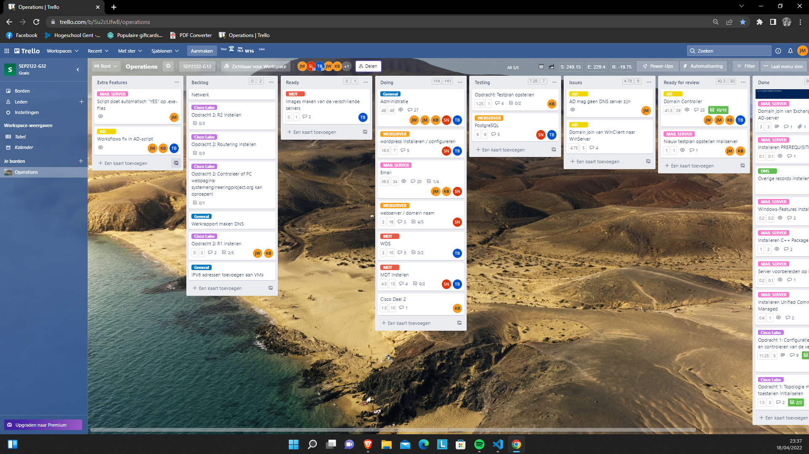
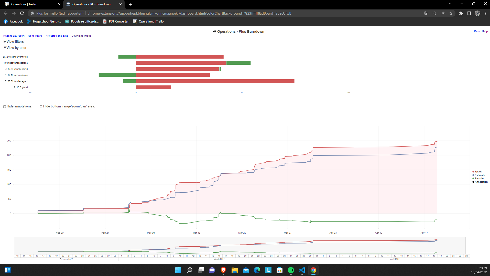
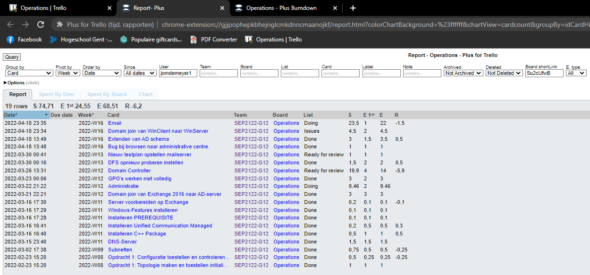
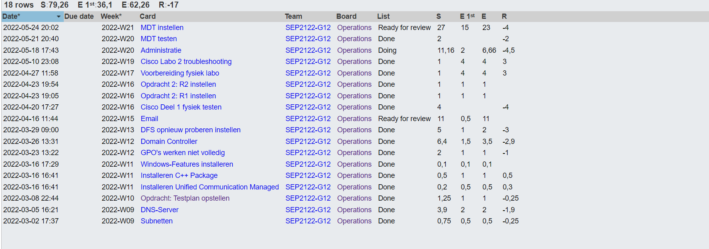
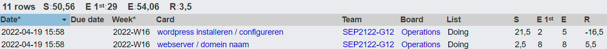

# Voortgangsrapport week 8

* Groep: 12
* Datum voortgangsgesprek: 20/04/2022

| Student              | Aanw. | Opmerking |
| :------------------- | :---- | :-------- |
| Jorn De Meyer        |       |           |
| Jochen Wimme         |       |           |
| Kevin Benoit         |       |           |
| Sander Van Noten     |       |           |
| Tibbe Van Den Berghe |       |           |

## Wat heb je deze week gerealiseerd?

### Algemeen

### Jorn De Meyer

* Deze week heb ik hard gewerkt aan het installeren en configureren van de AD server. De installatie is gelukt, configuratie moet nog afgewerkt worden. Nu is er juist het probleem dat ik de DNS role heb verwijderd van de AD-server. Hierdoor lukt het domein joinen niet meer... Dit probleem moet ASAP opgelost worden!

### Jochen Wimme

* ...

[Afbeelding individueel rapport tijdregistratie]

### Kevin Benoit 

* Deze week heb ik verder gewerkt aan de Exchange server en ben ik begonnen aan Cisco Labo 2. 

### Sander Van Noten

* Ik heb deze week vooral research gedaan over het instellen en gebruiken van de MDT

[Afbeelding individueel rapport tijdregistratie]

### Tibbe Van Den Berghe

* Ik heb in de vakantie niet al te veel gedaan zodat de rest van het team zijn uren wat hoger kunnen krijgen.
* Ik heb HTTPS en de virtualhosts van apache ingesteld en .htaccess gebruikt om automatisch door te verwijzen naar https i.p.v. http

## Wat plan je volgende week te doen?

### Algemeen

### Jorn De Meyer
Graag wens ik volgende week de exchange server af te werken. Ik vrees dat, door het probleem met de domein join door DNS, dat dit niet klaar zal zijn tegen de deadline...

### Sander Van Noten
Ik wil graag beginnen aan het instellen van gebruiken van de MDT. 
### Student 3
### Tibbe Van den Berghe
Fout oplossing in de webserver (de deadline gaat wel verstreken zijn). Beginnen aan MDT

## Waar hebben jullie nog problemen mee?

* AD server / e-mail server: Domein joinen (Lukt niet meer door gebruik te maken van Linux DNS server)
* HTTP/2 en de webserver securen tegen een nmap scan.

## Feedback technisch luik

### Algemeen

### Student 1
### Student 2
### Student 3
### Student 4
### Student 5

## Feedback analyseluik

### Algemeen

### Student 1
### Student 2
### Student 3
### Student 4
### Student 5
