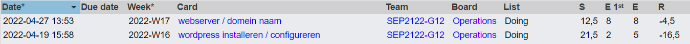
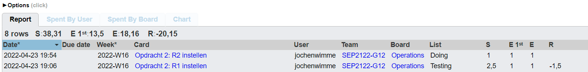

# Vo/ortgangsrapport week 9

* Groep: 12
* Datum voortgangsgesprek: 28/04/2022

| Student              | Aanw. | Opmerking |
| :------------------- | :---- | :-------- |
| Jorn De Meyer        |       |           |
| Jochen Wimme         |       |           |
| Kevin Benoit         |       |           |
| Sander Van Noten     |       |           |
| Tibbe Van Den Berghe |       |           |

## Wat heb je deze week gerealiseerd?

### Algemeen
Deze week werd langs de windowskant de email-server bijna afgewerkt. Hiermee bedoelen we dat de gebruikers nu de mogelijkheid hebben om elkaar te mailen. 

### Jorn De Meyer

* Het is me deze week gelukt om emailverkeer te kunnen voorzien voor de emailserver. Gebruikers binnen het domein kunnen nu naar elkaar emails versturen. Nu moet ik enkel nog de spamfilter en virusscanner installeren en configureren en daarna het script een beetje bijsturen en tweaken.

### Sander Van Noten 

* Deze week heb ik mij beziggehouden met Jorn te helpen bij het opzetten van de emailserver aangezien er nog enkele vragen waren rond de DNS server en AD server.  Verder heb ik mij voorbereid om het fysieke labo dat we deze week moeten uitvoeren.

[Afbeelding individueel rapport tijdregistratie]

### Kevin benoit

* Deze week heb ik mij beziggehouden met Cisco Labo 1 en 2 samen met Jochen, we zijn goed opweg met Labo 2 en hopen die zo snel mogelijk af te werken. Ook heb ik mij voorbereid om het fysieke labo van deze week uit te voeren.

### Tibbe Van den Berghe

* Bezig gezeten aan de webserver, nog 1 fout dat de css niet laad bij https. De rest werkt.

### Jochen Wimme

* Labo 1 getest en voorbereid op het fysieke labo. Labo 2 begonnen en bijna af.

## Wat plan je volgende week te doen?

### Algemeen
### Jorn De Meyer
* Volgende week zou ik graag de virusscanner en spamfilter willen geïnstalleerd hebben. Misschien een beetje optimistisch, maar ik denk dat dit mogelijk moet zijn.
### Sander Van Noten 
* Volgende week wil ik beginnen met MDT te gaan implementeren. Hierover heb ik al research gedaan.
### Jochen Wimme
* Volgende week hoop ik labo 2 af te werken, hierbij zijn al 2 routers ingesteld.
### Tibbe Van den Berghe
* Volgende week ga ik werken aan MDT en WDS.
### Student 5

## Waar hebben jullie nog problemen mee?

* Email-server: Niet echt problemen meer, de meeste zijn momenteel opgelost.
* 

## Feedback technisch luik

### Algemeen

### Student 1
### Student 2
### Student 3
### Student 4
### Student 5

## Feedback analyseluik

### Algemeen

### Student 1
### Student 2
### Student 3
### Student 4
### Student 5
