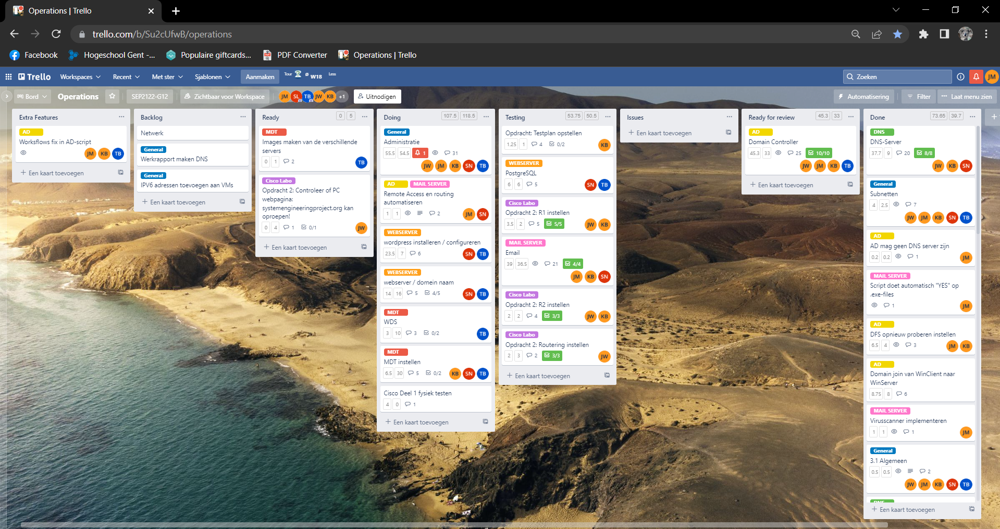
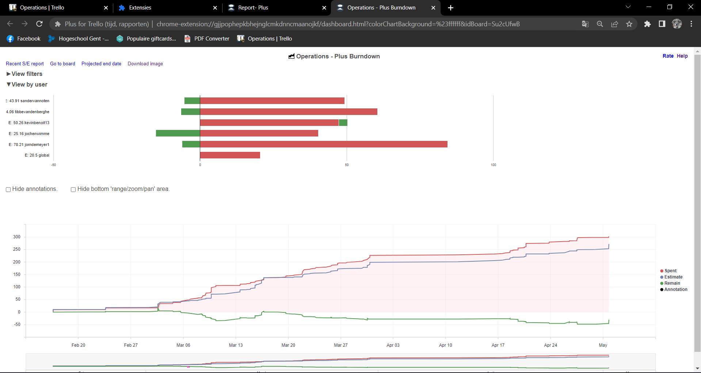
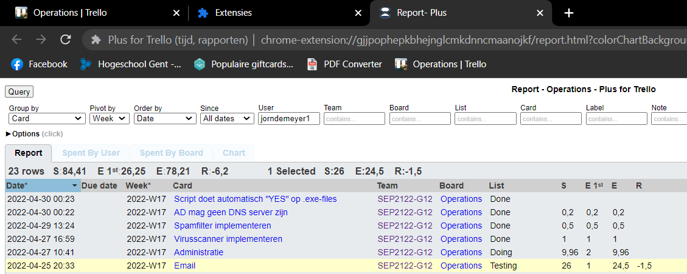
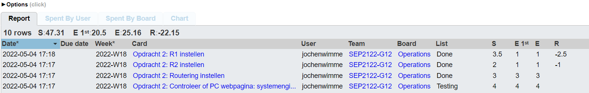
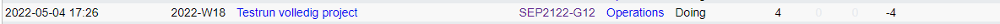

# Voortgangsrapport week 10

- Groep:
- Datum voortgangsgesprek:

| Student       | Aanw. | Opmerking |
| :------------ | :---- | :-------- |
| Jorn De Meyer |       |           |
| student2      |       |           |
| student3      |       |           |
| Tibbe Van den Berghe      |       |           |
| student5      |       |           |

## Wat heb je deze week gerealiseerd?

### Algemeen

### Jorn De Meyer

- Ik heb vorige week de email-server werkende gekregen. Er is een spamfilter, virusscanner en er kunnen e-mails worden verzonden tussen de clients onderling. Ik ga me nu, voor de rest van dit academiejaar, nog bezighouden met het op punt zetten van het script. Hiermee bedoel ik, zeker zijn dat alles mooi kan runnen en nog wat kleine aanpassingen doen. Ook zal ik wat proberen helpen met de andere opdrachten die nog moeten afgewerkt worden.

### Jochen Wimme

- Ik heb vorige en deze week Cisco labo 2 afgewerkt. en cisco labo 1 in klas op de fysieke toestellen werkende gekregen.

[Afbeelding individueel rapport tijdregistratie]

### Sander Van Noten 

- Cisco labo testen en eindproces simuleren + MDT in orde brengen

### Kevin Benoit
- MDT in orde brengen en cisco labo testen

### Tibbe Van den Berghe

- Bezig gezeten aan het finishen van de webserver

## Wat plan je volgende week te doen?

### Algemeen

### Jorn De Meyer

- Het e-mailserver script verder optimaliseren. Ik heb een snapshot genomen van de werkende staat. Ik zal hem nu terugzetten naar een clean install staat, en hierop zaken testen. Ook zou ik graag volgende week de emailserver opleveren aan meneer Maenhaut.

### Jochen Wimmer

- Testrapport voor email server schrijven en testen

### Kevin Benoit

- MDT zo ver mogelijk proberen krijgen en errors proberen fixen

### Tibbe Van den Berghe

- Testen netwerk met de verschillende servers

### Student 5

## Waar hebben jullie nog problemen mee?

- Windows-kant: Niks meer, alles is afgewerkt. Nu juist nog zaken op punt stellen.
- ...

## Feedback technisch luik

### Algemeen

### Student 1

### Student 2

### Student 3

### Student 4

### Student 5

## Feedback analyseluik

### Algemeen

### Student 1

### Student 2

### Student 3

### Student 4

### Student 5
