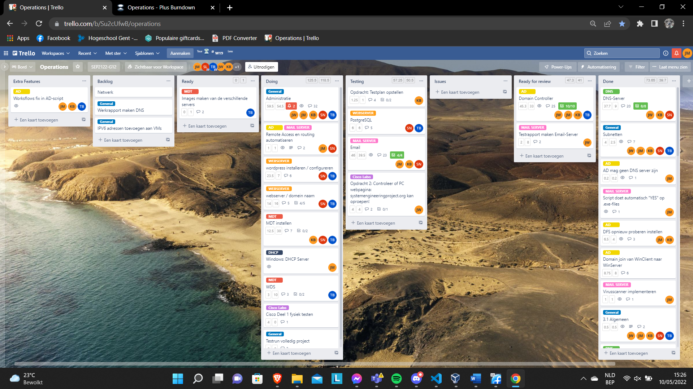
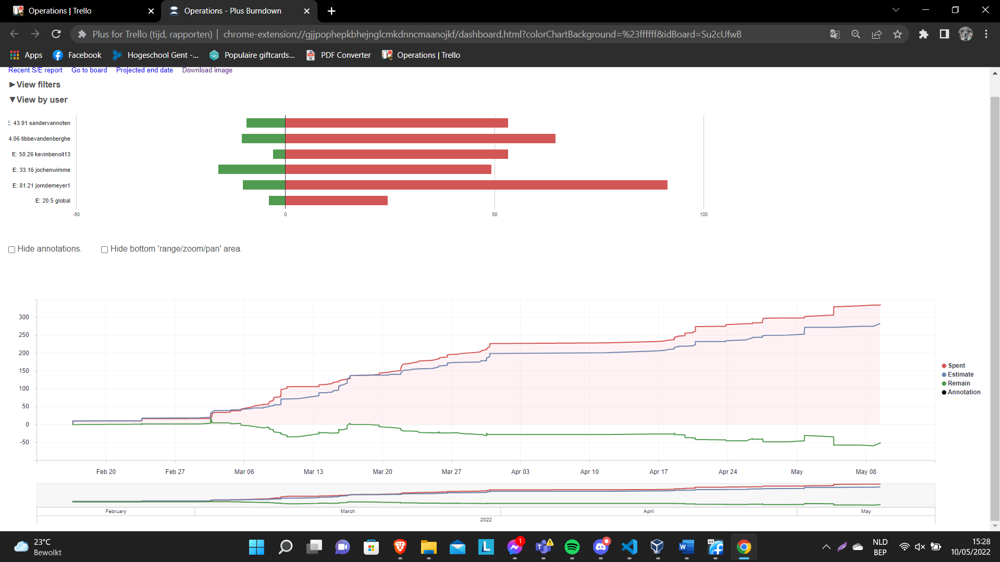
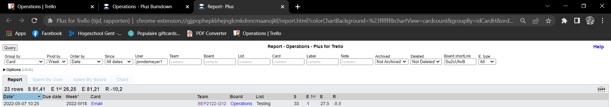
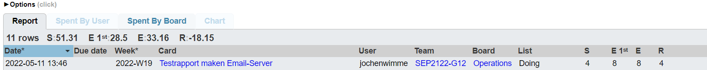
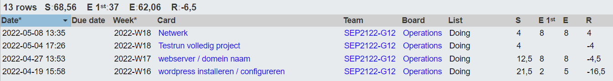
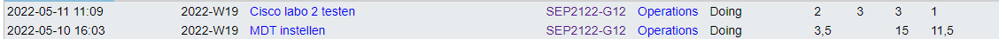

# Voortgangsrapport week 11

- Groep: 12
- Datum voortgangsgesprek: 10/05/2022

| Student              | Aanw. | Opmerking |
| :------------------- | :---- | :-------- |
| Jorn De Meyer        |       |           |
| Jochen Wimme         |       |           |
| student3             |       |           |
| Tibbe Van den Berghe |       |           |
| student5             |       |           |

## Wat heb je deze week gerealiseerd?

### Algemeen

### Jorn De Meyer

- Afgelopen week ben ik nog een beetje beziggeweest met het tweaken van het AD-script en email-script.

### Jochen Wimme

- Afgelopen week heb ik de Ad server getest alsook begonnen met de mailserver, maar door een gecrashte AD server moest ik terug herbeginnen.

[Afbeelding individueel rapport tijdregistratie]

### Kevin Benoit

-  Afgelopen week heb ik gewerkt aan de Cisco Labo 2 en aan de MDT server

![W11_Kevin] (img/Kevin/W11.png)

### Tibbe Van den Berghe

- Testen van het netwerk fysiek en in packet tracer. Er is nog wat tweaking aan nodig

### Sander Van Noten
- Testen van fysiek netwerk , MDT verder werken.

## Wat plan je volgende week te doen?

### Algemeen

### Jorn De Meyer

- De AD-server moet fungeren als DHCP server. Dit zal ik tegen de week nadien in orde kunnen brengen, aangezien dit niet zoveel werk is.

### Jochen Wimmer

- Testplan van Email-server afwerken.

### Kevin Benoit
- Ik wil deze week MDT afhebben en dan ook al de MDT testen.
### Tibbe Van den Berghe

- Nog een final test doen met al de servers voor het netwerk te smimuleren. Er zijn soms wel switches etc te weinig beschikbaar.

### Student 5

## Waar hebben jullie nog problemen mee?

- Windows-kant: Niks.
- ...

## Feedback technisch luik

### Algemeen

### Student 1

### Student 2

### Student 3

### Student 4

### Student 5

## Feedback analyseluik

### Algemeen

### Student 1

### Student 2

### Student 3

### Student 4

### Student 5
