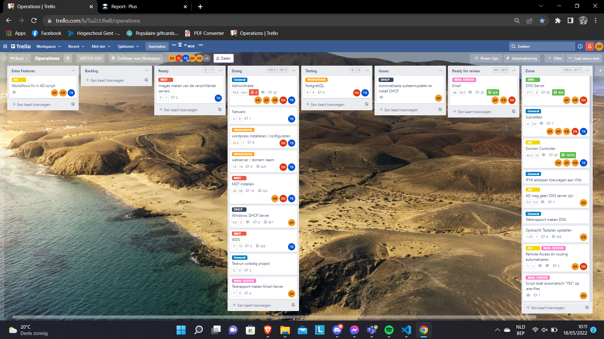
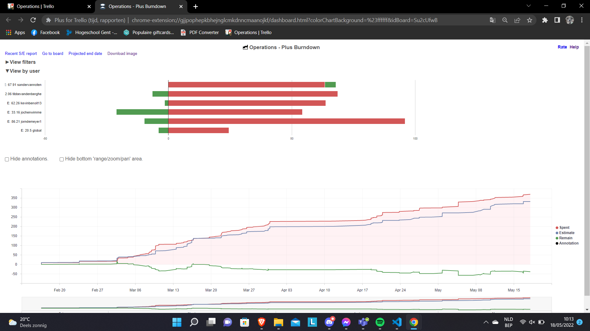
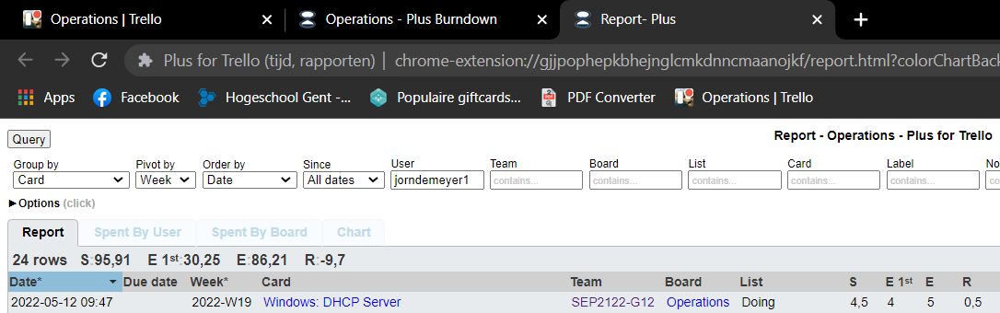
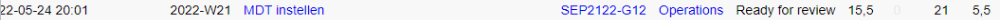
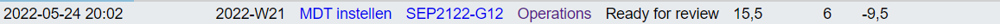

# Voortgangsrapport week nn

* Groep: 2 
* Datum voortgangsgesprek: 18/05/2022

| Student  | Aanw. | Opmerking |
| :---     | :---  | :---      |
| Jorn De Meyer |       |           |
| student2 |       |           |
| student3 |       |           |
| student4 |       |           |
| student5 |       |           |

## Wat heb je deze week gerealiseerd?

### Algemeen
Deze week werden er nog een aantal last-minute aanpassingen gedaan aan de e-mailserver. 
Er werd ook gewerkt aan het tesrapport van de e-mailserver.

[Afbeelding teamoverzicht tijdregistratie onderverdeeld per deelopdracht]

### Jorn De Meyer
Ik heb deze week nog een laatste aantal tweaks gedaan aan de e-mailserver. Ook hielp ik Jochen bij het opstellen van het testrapport.

* ...

### Sander Van Noten

* MDT volledig werkende gekregen samen met kevin + een clien deployen

[Afbeelding individueel rapport tijdregistratie]

### Kevin Benoit

* Deze week ik heb ik de MDT gefinetuned. Samen met Sander. Ook heb ik Jochen geholpen om op zijn laptop een MDT werkende te krijgen.

### Tibbe Van den Berghe

* Topologie aanpassen zoals gewenst. Alles nog eens controleren verschillende servers etc...

[Afbeelding individueel rapport tijdregistratie]

## Wat plan je volgende week te doen?

### Algemeen
### Jorn De Meyer
Ik ga me vooral bezighouden met het helpen van iedereen waar ik kan helpen en ook wil ik samen met Jochen zijn installatie van Exchange in orde brengen.

### Student 2
### Kevin Benoit
Dit was de laatste week, ik ga wel nog kijken wat wij nog kunnen finetunen.
### Tibbe Van den Berghe
* Topologie klaar krijgen en zien dat alles werkt. Thuis eens testen met 2 servers.

## Waar hebben jullie nog problemen mee?

* 

## Feedback technisch luik

### Algemeen

### Student 1
### Student 2
### Student 3
### Student 4
### Student 5

## Feedback analyseluik

### Algemeen

### Student 1
### Student 2
### Student 3
### Student 4
### Student 5
